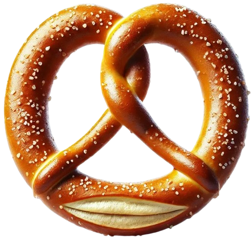
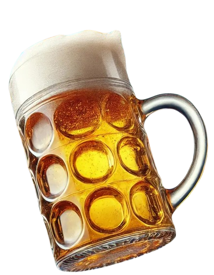
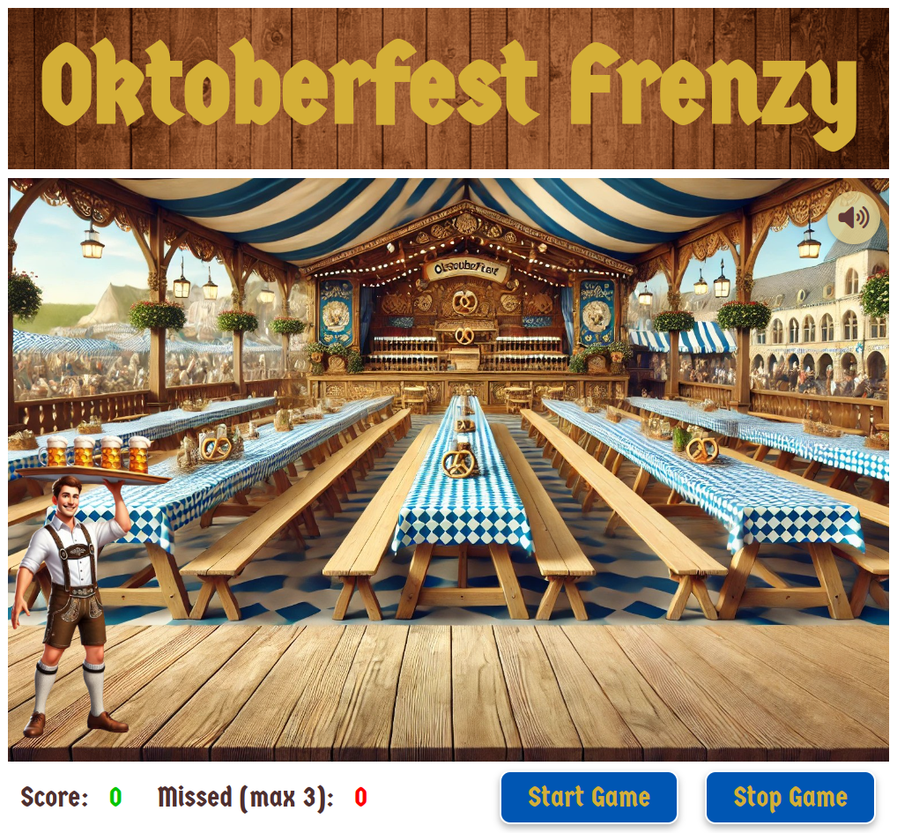
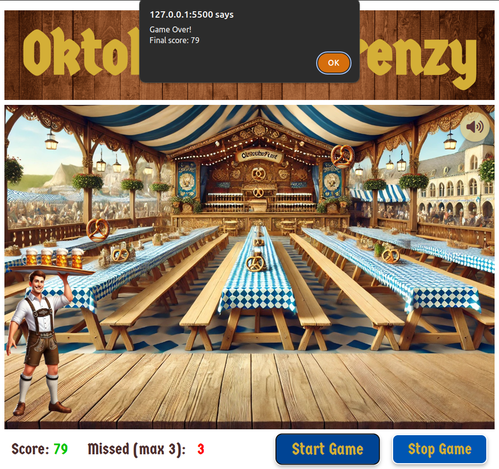

# Oktoberfest Frenzy Catching Game

**Oktoberfest Frenzy** is an interactive web-based game where players catch falling objects (pretzels and beers) during an Oktoberfest celebration. The goal is to catch as many pretzels and beers as possible while avoiding missing more than 3 objects!

 

This game was created as a fun way to practice **event listeners** in JavaScript, focusing on real-time interactions, keypress handling, and dynamic DOM manipulation. You might be wondering—why an Oktoberfest theme? Well, it's October, this year's edition is coming to an end, and as a fan of the event (controversial, I know!), I thought it would be the perfect inspiration. I had a blast coding and playing this game, and I hope you enjoy it too!

**Note**: This game is designed for desktop browsers and is not suitable (at least yet) for mobile devices.

## Table of Contents

- [Game Features](#game-features)
- [Gameplay Instructions](#gameplay-instructions)
- [Technological Components](#technological-components)
- [Start Playing](#start-playing)
- [Game Preview](#game-preview)

## Game Features

- **Catch Falling Objects**: Catch pretzels and beers to score points.
- **Oktoberfest Theme**: The game has a Oktoberfest vibe with background music and themed visuals.
- **Score Tracking**: The game tracks both the number of objects caught and missed.
- **Responsive Audio Control**: Background music can be toggled on or off via a volume icon.
- **Game Over Mechanism**: The game ends when the player misses 3 objects, with a game-over alert displaying the final score.

## Gameplay Instructions

1. **Start the Game**: Click the "Start Game" button to begin.
2. **Move the Collector**: Use the left (`←`) and right (`→`) arrow keys to move the collector and catch the falling pretzels and beers.
   - **Pretzels** score 2 points.
   - **Beers** score 1 point.
3. **Avoid Missing**: You can miss up to 3 objects. After 3 misses, the game ends.

**Note**: This game is intended to be played on a computer. It is not optimized for mobile devices yet.

## Technological Components

- **HTML5**: Structure of the game.
- **CSS3**: Styling, layout, and animation of elements.
- **JavaScript (ES6+)**: Game logic, movement, scoring, and interaction.
- **Font Awesome**: For the volume control icons.
- **Google Fonts**: Custom font for the Oktoberfest-themed text.
- **AI**: Generating game images and refining game logic.

## Start Playing

You can play **Oktoberfest Frenzy** directly in your browser through GitHub Pages. No setup is required!   
**Note**: This game is intended to be played on a computer. It is not optimized for mobile devices yet.

[Click here to play the game](https://diecatiamonteiro.github.io/Oktoberfest-Catching-Game/)

## Game Preview

### 1. Main Game Area

 

### 2. Game Over Screen

 

---

# Thanks for reading. Enjoy the game!
